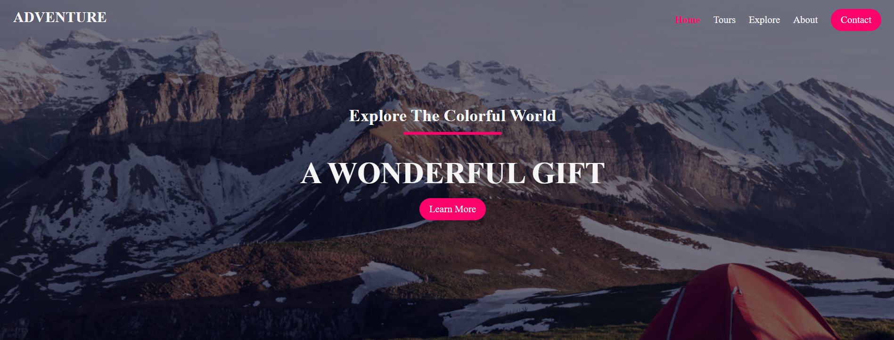
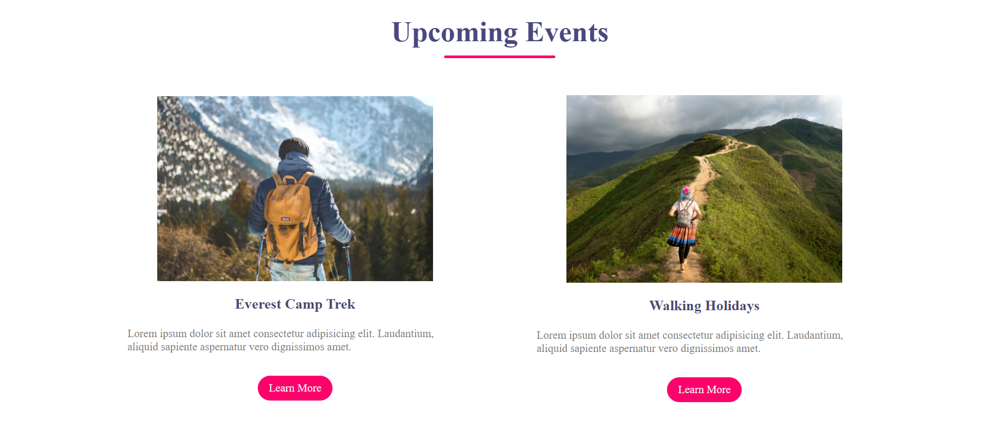
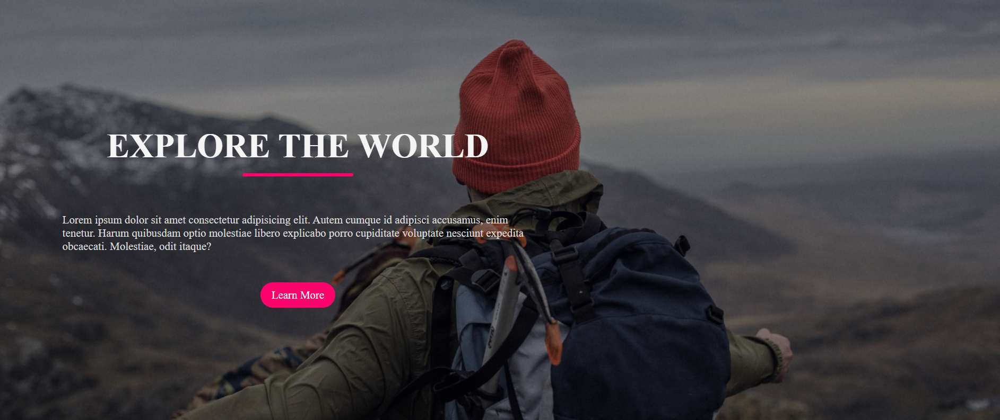
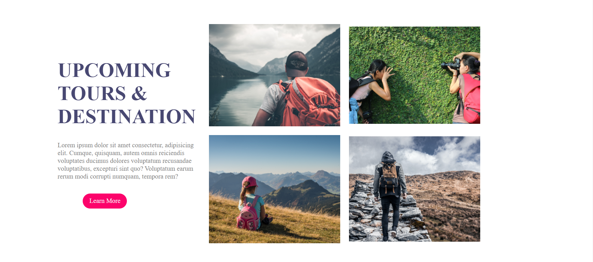

<h1 align = "center">Travel Website using HTML & CSS</h1> 

---  
   

For more Website Follow Me ➡️ [GitHub](https://github.com/abdul-alim-0)    

<h1 align="center"> Website Preview </h1>  

### For Live Overview ➡️ [Travel Website](https://abdul-alim-0.github.io/adventure_travel_website/)   

  

  

## Features 📋
⚡️ Fully Responsive.\
⚡️ Valid HTML & CSS.\
⚡️ Smooth scrolling in each section.\
⚡️ Compatible with all mobile devices and with a beautiful and pleasant user interface.\
⚡️ Easy to modify.

## Installation & Deployment 📦
- Clone the repository and modify the content of <b>index.html</b> 
- Add or remove images from `assets/img/` directory as per your requirement.
- Update the info of `Events & Tours` folder according to your need
- To deploy your website, first you need to create github repository with name `<your-github-username>.github.io` and push the generated code to the `main` branch.

## Contributing 💡
#### Step 1

- **Option 1**
    - 🍴 Fork this repo!

- **Option 2**
    - 👯 Clone this repo to your local machine.

#### Step 2

- **Build your code** 🔨🔨🔨

#### Step 3

- 🔃 Create a new pull request.